# Sandboxxer Plugin Diagrams

This directory contains Mermaid diagrams visualizing the sandboxxer plugin architecture, workflows, and data flows.

## ⚠️ CRITICAL: Mermaid Source Preservation

**NEVER delete .mmd source files!** Each diagram consists of two files:
- **`.mmd` (Mermaid source)**: Editable diagram definition - **THIS IS THE SOURCE OF TRUTH**
- **`.svg` (SVG output)**: Generated image for documentation - can be regenerated from .mmd

If you delete a `.mmd` file, the diagram becomes **permanently uneditable**. Always keep both files in version control.

**Validation:** Run `bash scripts/diagram-inventory.sh` to verify all diagrams have source files.

## Available Diagrams

### 1. Plugin Architecture

**File:** [`plugin-architecture.mmd`](plugin-architecture.mmd) | **SVG:** [`svg/plugin-architecture.svg`](svg/plugin-architecture.svg)

**Purpose:** Shows the component hierarchy of the sandboxxer plugin.

**Components visualized:**
- **Commands (8)**: `/quickstart`, `/yolo-docker-maxxing`, `/troubleshoot`, `/audit`, `/deploy-to-azure`, `/yolo-linux-maxxing`, `/linux-troubleshoot`, `/health`
- **Skills (3)**: `sandboxxer-troubleshoot`, `sandboxxer-audit`, `sandboxxer-linux-troubleshoot`
- **Agents (3)**: `devcontainer-generator`, `devcontainer-validator`, `interactive-troubleshooter`
- **Hooks (1)**: PreToolUse for Docker safety
- **Shared Resources**: Templates, data catalogs, language partials

**Used in:** README.md, docs/ARCHITECTURE.md


---

### 2. Quickstart Setup Flow (v2)

**File:** [`quickstart-flow.mmd`](quickstart-flow.mmd) | **SVG:** [`svg/quickstart-flow.svg`](svg/quickstart-flow.svg)

**Purpose:** Interactive setup workflow showing the `/quickstart` command with profile-based selection.

**Workflow (5 phases, max 4 questions):**
1. **Phase 0: Settings Load** - Read defaults from `.claude/sandboxxer.local.md`
2. **Phase 1: Discovery** - Detect project context, scan for languages, check ports
3. **Phase 2: Configuration** - Profile selection (Minimal/Backend/Full Stack/Custom), firewall preset, workspace mode
4. **Phase 3: Generation** - Copy templates, apply partials, configure firewall
5. **Phase 4: Report** - Summary of files created and next steps

**Profiles:**
- **Minimal** - Python 3.12 + Node 20 only
- **Backend** - + Go 1.22, PostgreSQL tools
- **Full Stack** - + Go, Rust, PostgreSQL tools
- **Custom** - Select individual tools

**Used in:** docs/diagrams/README.md (documentation reference only - not embedded in other docs)


---

### 3. File Generation Process

**File:** [`file-generation.mmd`](file-generation.mmd) | **SVG:** [`svg/file-generation.svg`](svg/file-generation.svg)

**Purpose:** Shows how templates are processed to generate DevContainer files.

**Flow:**
- **Input:** Templates, data catalogs, language partials
- **Processing:** Copy templates, append partials, replace placeholders, configure firewall
- **Output:** .devcontainer/ directory with Dockerfile, devcontainer.json, docker-compose.yml, init-firewall.sh

**Used in:** docs/ARCHITECTURE.md


---

### 4. Mode Selection

**File:** [`mode-selection.mmd`](mode-selection.mmd) | **SVG:** [`svg/mode-selection.svg`](svg/mode-selection.svg)

**Purpose:** Decision tree for selecting the appropriate Docker Compose mode.

**Modes:**
- **Standard Bind Mount** (`docker-compose.yml`) - Linux default, direct file editing
- **Volume Mode** (`docker-compose.volume.yml`) - Windows/macOS, fast I/O with volume
- **Prebuilt Mode** (`docker-compose.prebuilt.yml`) - CI/CD with pre-built images
- **Profiles Mode** (`docker-compose-profiles.yml`) - Backend/frontend service isolation

**Used in:** docs/features/SETUP-OPTIONS.md


---

### 5. Security Layers

**File:** [`security-layers.mmd`](security-layers.mmd) | **SVG:** [`svg/security-layers.svg`](svg/security-layers.svg)

**Purpose:** Visualizes the 3-layer security model.

**Layers:**
- **Layer 1: Container Isolation** - Namespaces, cgroups, capabilities, read-only filesystem
- **Layer 2: Network Isolation** - Firewall modes (disabled/strict), iptables + ipset, domain allowlist
- **Layer 3: Secret Management** - VS Code inputs, Docker secrets, host mounts

**Used in:** docs/features/SECURITY-MODEL.md


---

### 6. Troubleshooting Flow

**File:** [`troubleshooting-flow.mmd`](troubleshooting-flow.mmd) | **SVG:** [`svg/troubleshooting-flow.svg`](svg/troubleshooting-flow.svg)

**Purpose:** Decision tree for diagnosing and resolving common sandbox issues.

**Categories:**
- Container issues (startup, crashes, build errors)
- Network issues (connectivity, DNS, firewall)
- Service connection problems (PostgreSQL, Redis)
- Firewall blocking
- Permission errors
- VS Code DevContainer issues

**Used in:** docs/features/TROUBLESHOOTING.md


---

### 7. Azure Deployment Flow

**File:** [`azure-deployment-flow.mmd`](azure-deployment-flow.mmd) | **SVG:** [`svg/azure-deployment-flow.svg`](svg/azure-deployment-flow.svg)

**Purpose:** Multi-step Azure Container Apps deployment pipeline.

**Phases:**
1. Pre-flight validation (Docker, DevContainer, Azure CLI)
2. Authentication (interactive or service principal)
3. Configuration (subscription, environment, region, scaling)
4. Infrastructure generation (azure.yaml, Bicep modules)
5. Deployment process (provision, build, push, deploy)
6. Post-deployment verification

**Used in:** commands/deploy-to-azure.md, docs/features/AZURE-DEPLOYMENT.md


---

### 8. Secrets Flow

**File:** [`secrets-flow.mmd`](secrets-flow.mmd) | **SVG:** [`svg/secrets-flow.svg`](svg/secrets-flow.svg)

**Purpose:** Secret type decision tree and method selection.

**Secret Types:**
- **Development** - VS Code input variables
- **Build-time** - Docker build secrets (not in layers)
- **Runtime Production** - Docker runtime secrets (tmpfs)
- **Cloud CLI** - Host config mounts (read-only)

**Includes:** Secret lifecycle (creation → storage → distribution → usage → rotation → revocation) and anti-patterns to avoid

**Used in:** docs/features/SECRETS.md


---

### 9. Firewall Resolution

**File:** [`firewall-resolution.mmd`](firewall-resolution.mmd) | **SVG:** [`svg/firewall-resolution.svg`](svg/firewall-resolution.svg)

**Purpose:** Sequence diagram showing how firewall processes domain allowlists.

**Process:**
1. init-firewall.sh reads ALLOWED_DOMAINS
2. DNS resolution (domain → IP addresses)
3. ipset creation (IPs added to hash:net)
4. iptables rule application
5. Verification tests
6. Runtime enforcement

**Used in:** docs/features/SECURITY-MODEL.md


---

### 10. Security Audit Flow

**File:** [`security-audit-flow.mmd`](security-audit-flow.mmd) | **SVG:** [`svg/security-audit-flow.svg`](svg/security-audit-flow.svg)

**Purpose:** 12-step security audit workflow from `/sandboxxer:audit`.

**Audit Steps:**
1. Scan configuration files
2. Firewall configuration audit
3. Credentials and secrets audit
4. Port exposure audit
5. Container permissions audit
6. Volume and mount audit
7. Network isolation audit
8. Dependency security
9. Lifecycle hooks security
10. Dev Container features audit
11. Dotfiles security
12. Environment variables security

**Used in:** skills/sandboxxer-audit/SKILL.md


---

### 11. Service Connectivity

**File:** [`service-connectivity.mmd`](service-connectivity.mmd) | **SVG:** [`svg/service-connectivity.svg`](svg/service-connectivity.svg)

**Purpose:** Docker network topology and correct/incorrect connection patterns.

**Shows:**
- Docker bridge network architecture
- Correct patterns: Using service names (postgres:5432, redis:6379)
- Incorrect patterns: Using localhost or 127.0.0.1
- Docker DNS resolution process
- Common troubleshooting issues

**Used in:** docs/features/TROUBLESHOOTING.md


---

### 12. CI/CD Integration

**File:** [`cicd-integration.mmd`](cicd-integration.mmd) | **SVG:** [`svg/cicd-integration.svg`](svg/cicd-integration.svg)

**Purpose:** GitHub Actions / Azure DevOps pipeline sequence.

**Pipeline Stages:**
1. Setup: Service principal creation, repository secrets
2. Development: Code push triggers pipeline
3. CI/CD execution: Authentication, provision, build
4. Build & Deploy: Container build, ACR push, deployment
5. Post-deployment: Health checks, smoke tests, rollback
6. Monitoring: Logs and metrics

**Used in:** docs/features/AZURE-DEPLOYMENT.md


---

### 13. Bubblewrap Architecture (Native Linux)

**File:** [`bubblewrap-architecture.mmd`](bubblewrap-architecture.mmd) | **SVG:** [`svg/bubblewrap-architecture.svg`](svg/bubblewrap-architecture.svg)

**Purpose:** Visualizes the native Linux/WSL2 sandboxing architecture using bubblewrap, highlighting security tradeoffs vs Docker.

**Security Layers:**
- **Layer 1: Bubblewrap Namespace Isolation** - Read-only root, device access, proc isolation, tmpfs
- **Layer 2: Seccomp Filter (Optional)** - @anthropic-ai/sandbox-runtime syscall filtering

**Missing vs Docker:**
- ❌ Network isolation (direct host network access)
- ❌ Resource limits (no CPU/memory caps)
- ❌ Container boundaries (shared kernel, no cgroups)
- ❌ Firewall/Allowlist (cannot restrict domains)

**Used in:** commands/yolo-linux-maxxing.md, docs/diagrams/README.md



---

### 14. Setup Command Comparison

**File:** [`setup-comparison.mmd`](setup-comparison.mmd) | **SVG:** [`svg/setup-comparison.svg`](svg/setup-comparison.svg)

**Purpose:** Decision tree helping users choose between `/quickstart`, `/yolo-docker-maxxing`, and `/yolo-linux-maxxing`.

**Commands Compared:**
- **/quickstart** - Interactive with up to 4 questions, profile selection, optional firewall
- **/yolo-docker-maxxing** - Zero questions, Python+Node base, Docker isolation only
- **/yolo-linux-maxxing** - No Docker required, bubblewrap sandboxing, optional flags

**Decision Points:**
1. Do you have Docker installed?
2. Need customization?
3. Priority: speed vs security?

**Used in:** docs/diagrams/README.md, docs/features/SETUP-OPTIONS.md



---

### 15. Linux Setup Flow

**File:** [`linux-setup-flow.mmd`](linux-setup-flow.mmd) | **SVG:** [`svg/linux-setup-flow.svg`](svg/linux-setup-flow.svg)

**Purpose:** Visualizes the 10-step `/yolo-linux-maxxing` installation process with optional enhancement flags.

**Phases:**
1. **Preflight** - Environment detection (WSL2/Linux), sudo validation, disk space check
2. **Core Installation** - System packages, GitHub CLI, Claude Code CLI, environment config, seccomp
3. **Optional Enhancements** - Dev tools, shell enhancements, project config, VS Code extensions
4. **Verification** - Component check and troubleshooting

**Optional Flags:**
- `--with-tools` - Python + Node development tools
- `--with-shell` - zsh + Powerlevel10k + fzf + delta
- `--project-config` - .editorconfig, .gitignore, .gitattributes
- `--with-vscode` - VS Code extension recommendations
- `--full` - All optional features
- `--skip-validation` - Skip preflight checks

**Used in:** commands/yolo-linux-maxxing.md, docs/diagrams/README.md



---

### 16. Health Check Flow

**File:** [`health-check-flow.mmd`](health-check-flow.mmd) | **SVG:** [`svg/health-check-flow.svg`](svg/health-check-flow.svg)

**Purpose:** Visualizes the 11 diagnostic checks in `/health` command with conditional `--verbose` and `--include-network` flags.

**11 Checks:**
1. Docker Daemon (running, version ≥20.10)
2. Docker Compose (v2 plugin available)
3. Required Tools (jq required, git/gh optional)
4. VS Code & DevContainers extension
5. Disk Space (≥10GB recommended, ≥5GB minimum)
6. Port Availability (8000, 3000, 5432, 6379)
7. Running Containers (status information)
8. Config Files (devcontainer.json, docker-compose.yml validation)
9. Service Health (PostgreSQL, Redis if running)
10. Plugin Installation (docker-safety-hook.sh)
11. Network Connectivity (opt-in, may fail behind proxy)

**Flags:**
- `--verbose` - Detailed output with additional information
- `--include-network` - Enable network connectivity tests (⚠️ may fail behind proxy)

**Exit Codes:**
- **0** - Passed (or passed with warnings)
- **1** - Failed (critical issues found)

**Used in:** commands/health.md, docs/diagrams/README.md



---

### 17. Docker Sandbox Explained (Beginner-Friendly)

**File:** [`sandbox-explained.mmd`](sandbox-explained.mmd) | **SVG:** [`svg/sandbox-explained.svg`](svg/sandbox-explained.svg)

**Purpose:** Simple, approachable explanation of Docker sandbox for beginners unfamiliar with sandboxing concepts.

**Key Messages:**
- "A sandbox is a secure container that isolates code from your computer"
- "Think of it as a protective bubble - code runs inside but can't escape"
- Visual analogies: playground with fence, fish tank in house

**What It Shows:**
- Nested containment layers (Computer → Sandbox → Code)
- ✅ What sandbox CAN do (write code, run tests, access allowed sites)
- 🚫 What sandbox CANNOT do (delete files, access passwords, install malware)
- 🛡️ Protected resources outside the sandbox
- Three layers of protection explained in plain language

**Comparison to Technical Version:**
- **Technical:** [`security-layers.mmd`](security-layers.mmd) uses jargon (namespaces, cgroups, iptables)
- **Beginner:** This diagram uses analogies and plain language for newcomers

**Used in:** docs/diagrams/README.md (supplement to technical security diagrams)



---

### 18. Bubblewrap Explained (Beginner-Friendly)

**File:** [`bubblewrap-explained.mmd`](bubblewrap-explained.mmd) | **SVG:** [`svg/bubblewrap-explained.svg`](svg/bubblewrap-explained.svg)

**Purpose:** Simple explanation of bubblewrap as "lightweight shield" helping users choose between Docker and native Linux setup.

**Key Messages:**
- "Bubblewrap is a lightweight shield - faster than Docker but fewer protections"
- "Protects your system files from accidental changes"
- "Best for personal projects you trust; use Docker sandbox for untrusted code"

**What It Shows:**
- ✅ Protected by bubblewrap (read-only system files, process isolation)
- ⚠️ Still open/unprotected (full network access, no resource limits)
- ⚡ Why use bubblewrap (faster setup, no Docker required, native performance)
- 📊 When to use Docker vs Bubblewrap comparison
- Visual analogy: Docker = bank vault (maximum security), Bubblewrap = locked room (basic protection)

**Comparison to Technical Version:**
- **Technical:** [`bubblewrap-architecture.mmd`](bubblewrap-architecture.mmd) details namespaces, seccomp, syscalls
- **Beginner:** This diagram uses analogies and focuses on trade-offs for decision-making

**Used in:** docs/diagrams/README.md (supplement to technical bubblewrap architecture)



---

## Editing Diagrams

### Using Mermaid Live Editor (Recommended)

1. Open https://mermaid.live
2. Copy content from any `.mmd` file
3. Edit the diagram interactively
4. Download as SVG and save to `svg/` directory
5. Commit both `.mmd` source and `.svg` output

### Using Mermaid CLI

Requires Node.js and works in environments with browser support:

```bash
# Generate single diagram
npx -y @mermaid-js/mermaid-cli -i plugin-architecture.mmd -o svg/plugin-architecture.svg -b transparent

# Generate all diagrams
for file in *.mmd; do
    npx -y @mermaid-js/mermaid-cli -i "$file" -o "svg/${file%.mmd}.svg" -b transparent
done
```

**Note:** In Docker containers, you may need a puppeteer config to disable sandbox:

```json
{
  "args": ["--no-sandbox", "--disable-setuid-sandbox"]
}
```

Then use: `npx @mermaid-js/mermaid-cli -i <input> -o <output> -p puppeteer-config.json`

### Mermaid Syntax Reference

- **Flowchart:** `flowchart TD` (top-down) or `flowchart LR` (left-right)
- **Nodes:** `A[Rectangle]`, `B{Diamond}`, `C([Rounded])`
- **Edges:** `A --> B` (arrow), `A -.-> B` (dotted), `A -->|Label| B` (labeled)
- **Styling:** `style A fill:#90EE90,stroke:#333,stroke-width:2px`
- **Subgraphs:** `subgraph Title ... end`

Full reference: https://mermaid.js.org/intro/

---

## Color Coding

All diagrams follow this color scheme:

| Component Type | Color | Hex Code | Usage |
|----------------|-------|----------|-------|
| Commands | Light Green | `#90EE90` | Slash commands |
| Skills | Sky Blue | `#87CEEB` | Workflow skills |
| Agents | Orange | `#FFB366` | Subagents |
| Hooks | Red | `#FF6B6B` | Event hooks |
| Shared Resources | Purple | `#DDA0DD` | Templates/data |
| Decision Points | Peach | `#FFE4B5` | User choices |
| Processing | Light Gray | `#f0f0f0` | Internal processing |

---

## Embedding in Documentation

To embed diagrams in markdown files, use relative paths based on your file location.

**Markdown embedding syntax:**

See the path examples below for the correct relative path from your file location.

**Path examples based on file location:**

| Your file location | Path to use | Example |
|-------------------|-------------|---------|
| Repository root (e.g., README.md) | `docs/diagrams/svg/name.svg` | `plugin-architecture.svg` |
| Inside docs/ directory | `diagrams/svg/name.svg` | Used in ARCHITECTURE.md |
| Inside docs/diagrams/ | `svg/name.svg` | Used in this file |

**See existing embeddings:**
- README.md: View source to see diagram embeddings from repository root
- docs/ARCHITECTURE.md: View source to see diagram embeddings from docs/
- All embedded diagrams are in docs/diagrams/svg/ directory

---

## File Structure

```
docs/diagrams/
├── README.md                      # This file
├── puppeteer-config.json          # Config for Mermaid CLI in Docker
├── plugin-architecture.mmd        # Mermaid source files (18 total)
├── quickstart-flow.mmd
├── file-generation.mmd
├── mode-selection.mmd
├── security-layers.mmd
├── troubleshooting-flow.mmd
├── azure-deployment-flow.mmd
├── secrets-flow.mmd
├── firewall-resolution.mmd
├── security-audit-flow.mmd
├── service-connectivity.mmd
├── cicd-integration.mmd
├── bubblewrap-architecture.mmd    # Native Linux sandboxing architecture
├── setup-comparison.mmd           # Command selection decision tree
├── linux-setup-flow.mmd           # /yolo-linux-maxxing workflow
├── health-check-flow.mmd          # /health diagnostic checks
├── sandbox-explained.mmd          # Beginner-friendly Docker sandbox explanation
├── bubblewrap-explained.mmd       # Beginner-friendly bubblewrap explanation
└── svg/                           # Generated SVG files (18 total)
    ├── plugin-architecture.svg
    ├── quickstart-flow.svg
    ├── file-generation.svg
    ├── mode-selection.svg
    ├── security-layers.svg
    ├── troubleshooting-flow.svg
    ├── azure-deployment-flow.svg
    ├── secrets-flow.svg
    ├── firewall-resolution.svg
    ├── security-audit-flow.svg
    ├── service-connectivity.svg
    ├── cicd-integration.svg
    ├── bubblewrap-architecture.svg
    ├── setup-comparison.svg
    ├── linux-setup-flow.svg
    ├── health-check-flow.svg
    ├── sandbox-explained.svg
    └── bubblewrap-explained.svg
```

---

## Related Documentation

- [Plugin Architecture](../ARCHITECTURE.md) - Technical architecture overview
- [Setup Options](../features/SETUP-OPTIONS.md) - Command comparison and mode selection
- [Skills README](../../skills/README.md) - Skill documentation
- [Commands README](../../commands/README.md) - Command reference

